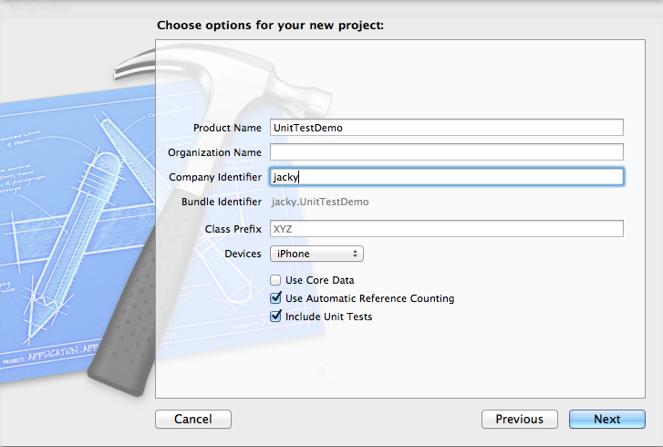

从XCode 2.1版本开始，Apple就已经把OCUnit集成到了自己的平台上，无需单独下载安装。而从XCode 4起，人们在创建iOS Application的时候，便可以同时创建测试target，如图所示：

OCUnit这个库其实非常简单，对用过JUnit的人来说更是易如反掌，然而要把单元测试写好却殊非易事——当然，这句话放到任何语言中都适用：）

下面我将通过一个简单的app来演示如何让测试代码更容易读懂，更容易维护。我会以TDD（测试驱动开发）的方式来实现这个app。

## 

需求是这样子的：有一个停车场，它需要提供停车和取车两个功能：车位未满时可以停车，车位满了以后不能停车。凭车牌号码即可取车。

在动手实现之前，我们先来想一下，怎么能够把它拆分成

* 
* 
* 

