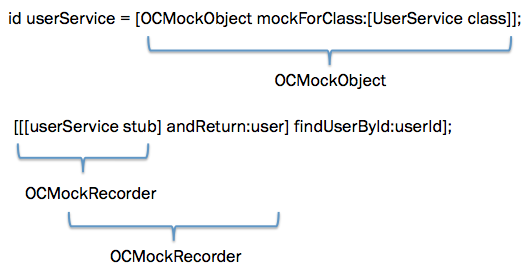

本文将通过实现一个简易版的OCMock框架，一步步讲述objective-c的运行时编程机制。

## 消息传递

我们先来看OCMock的一个最简单的用法：



- (void)test_should_find_users_by_id {
    NSString *userId = @"userId";
    User *user = [[User alloc] initWithId:userId andName:@"userName"];
    id userService = [OCMockObject mockForClass:[UserService class]];
    [[[userService stub] andReturn:user] findUserById:userId];

    UserController *controller = [[UserController alloc] initWithService:userService];
    User *actual = [controller findUserById:userId];
    STAssertEqualObjects([actual name], [user name], @"", nil);
}



在上面的测试中，我们stub了UserService，让它在被调用findUserById:的时候返回user，然后把service作为构造函数的参数传给了UserController，然后调用UserController的finderUserById方法，拿到返回值进行assert。当service会进行http请求或者数据库操作时，我们往往会通过stub的方式来进行对象隔离，这是mock框架的典型应用场景。

通过阅读OCMock的源码可以了解到，[OCMockObject mockForClass:[UserService class]]会返回OCMockObject对象，而[[userService stub] andReturn:user]得到的是OCMockRecorder
对象。参见下图：

看到这里，细心的读者可能就会发现问题了，findUserById:是UserService这个对象的方法，为什么测试中却可以在OCMockRecorder这个对象上调用该方法？

>一般来讲，当我们向某个对象发送了一条消息，但是该对象无法响应该条消息的时候，我们就会收到这样一条错误消息：unrecognized selector sent to instance 0x9164d90。但Objective-C运行时系统还提供了另一条途径，让我们可以把消息代理出去：如果某对象收到了它所无法响应的消息，运行时系统就会创建一个NSInvocation对象，在这个对象中包含了跟该消息相关的所有数据，如target、selector、参数及参数类型、返回类型，然后以NSInvocation对象为参数，调用目标对象上的forwardInvocation方法。

>所以，重写forwardInvocation，就可以实现消息传递的功能，即把收到的NSInvocation传递给其他对象，让其他对象进行处理。

>与此同时，我们还需要重写methodSignatureForSelector这个方法。当对象执行任何一个selector的时候，这个方法都会被调用，其作用是返回selector所对应的方法的方法签名（NSMethodSignature）。运行时系统需要拿到NSMethodSignature，才能创建NSInvocation。

于是，我们首先要在OCMockRecorder中重写methodSignatureForSelector和forwardInvocation两个方法，并且还要想办法拿到findUserById:这个方法的MethodSignature。

具体的实现方式是：第一步，让OCMock持有被mock的对象类型，重写OCMock的methodSignatureForSelector方法，让它直接去调用目标对象上的对应方法；第二步，把OCMock传给OCMockRecorder，让OCMockRecorder的methodSignatureForSelector方法调用OCMock的methodSignatureForSelector方法。

OCMock的实现代码如下：



- (id)initWithClass:(Class)aClass {
    self = [self init];
    if (self) {
        mockedClass = aClass;
    }
    return self;
}

- (OCMockRecorder *)stub{
    OCMockRecorder *recorder = [self getRecorder];
    [recorders addObject:recorder];
    return recorder;
}

- (OCMockRecorder *)getRecorder {
    OCMockRecorder *recorder = [[OCMockRecorder alloc] initWithSignatureResolver:self];
    return recorder;
}

- (NSMethodSignature *)methodSignatureForSelector:(SEL)aSelector {
    return [mockedClass instanceMethodSignatureForSelector:aSelector];
}



OCMockRecorder的实现代码如下：



- (id)andReturn: (id)anObject{
    return self;
}

- (id)initWithSignatureResolver:(OCMock *)mock {
    self = [super init];
    if(self){
        signatureResolver = mock;
    }
    return self;
}

- (NSMethodSignature *)methodSignatureForSelector:(SEL)aSelector {
    return [signatureResolver methodSignatureForSelector:aSelector];
}

- (void)forwardInvocation:(NSInvocation *)anInvocation {
    NSLog(@"forwarding...");
}



写到这里，执行最开始那段测试代码就不会再抛出unrecognized selector sent to instance……这样的错误了，但测试依然无法通过，这是因为OCMock和OCMockRecorder都还没有真正去处理findUserById:这条消息。而这时候就轮到forwardInvocation:发挥作用了。

回过头来再看测试代码中的这两行：

id userService = [OCMockObject mockForClass:[UserService class]];
[[[userService stub] andReturn:user] findUserById:userId];


如果我们希望userService在接受到findUserById:这条消息的时候就返回user对象，那就需要让OCMockRecorder把findUserById:对应的Invocation记录下来，在OCMockRecorder内部再增加一种机制，让userService（即OCMockObject）可以在需要的时候得到user对象。

## 参考资料

http://developer.apple.com/library/mac/#documentation/Cocoa/Conceptual/ObjCRuntimeGuide/Introduction/Introduction.html

http://developer.apple.com/library/mac/#documentation/Cocoa/Conceptual/ObjectiveC/Chapters/ocSelectors.html

https://developer.apple.com/library/mac/#documentation/Cocoa/Reference/Foundation/Classes/NSInvocation_Class/Reference/Reference.html

https://developer.apple.com/library/mac/#documentation/Cocoa/Conceptual/DistrObjects/Tasks/invocations.html

https://developer.apple.com/library/mac/#documentation/Cocoa/Reference/Foundation/Classes/NSObject_Class/Reference/Reference.html

https://developer.apple.com/library/mac/#documentation/General/Conceptual/DevPedia-CocoaCore/Selector.html

http://stackoverflow.com/questions/313400/nsinvocation-for-dummies

http://www.a-coding.com/2010/10/making-nsinvocations.html

http://cocoasamurai.blogspot.com/2010/01/understanding-objective-c-runtime.html
